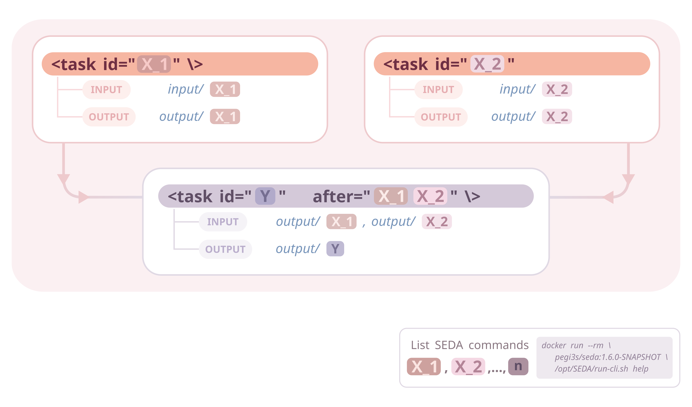
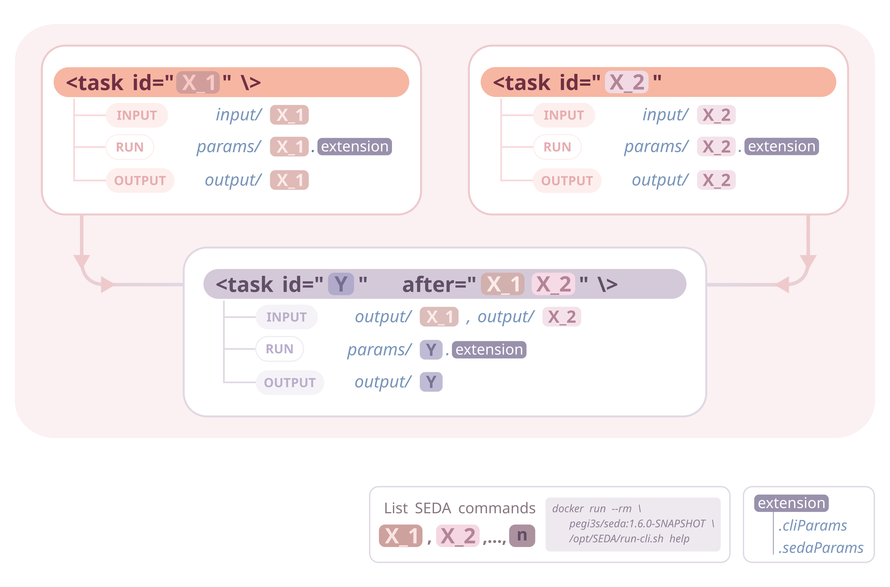
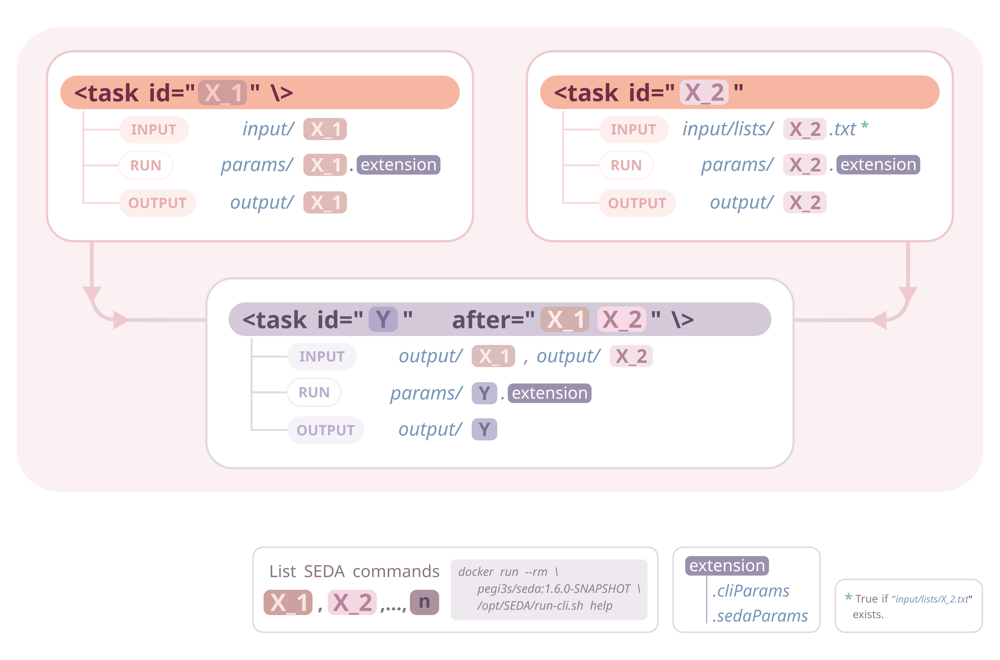

# SEDA pipelines with Compi

This project provides a framework for easily creating pipelines made up of [SEDA](https://www.sing-group.org/seda/) commands using [Compi](https://www.sing-group.org/compi/).

Compi pipelines are defined in an XML file that contains the pipeline parameters, task definitions and task dependencies. In a pipeline made up of SEDA commands all tasks would be essentially the same: running the specific SEDA command with a set of parameters over a set of input files; then, the input of each command would be the output of of its predecessor commands. As the SEDA CLI can read command parameters, this execution can be generalized so that pipeline developers should only declare the pipeline tasks (i.e. the SEDA CLI commands) and their execution order. 

This is what this framework provides: a generic execution engine for Compi-based pipelines that only requires developers to follow some conventions regarding input, output and parameter files. The image below illustrates these conventions, which are further explained before. 

<p align="center">
	
	</br>
</p>

# Table of Contents
- [SEDA pipelines with Compi](#seda-pipelines-with-compi)
- [Table of Contents](#table-of-contents)
- [Requirements](#requirements)
- [Getting started](#getting-started)
	- [Testing the sample pipeline](#testing-the-sample-pipeline)
	- [Creating your own SEDA pipeline](#creating-your-own-seda-pipeline)
- [Understanding Compi-based SEDA pipelines](#understanding-compi-based-seda-pipelines)
	- [Defining pipeline tasks: inputs and outputs](#defining-pipeline-tasks-inputs-and-outputs)
	- [SEDA command parameters](#seda-command-parameters)
	- [Running tasks for non-SEDA commands](#running-tasks-for-non-seda-commands)
	- [Running commands in batches](#running-commands-in-batches)
	- [An alternative way of specifying the input files](#an-alternative-way-of-specifying-the-input-files)
	- [Logging](#logging)
- [Contributors](#contributors)

# Requirements

- [Docker](https://www.docker.com/products/docker-desktop/), for running pipelines.
- [Compi Development Kit](https://www.sing-group.org/compi/), only for building pipeline Docker images.

# Getting started

You can do two things with this project:
1. Understand how SEDA pipelines can be easily created with Compi and try the example pipeline (`pipeline.xml`) available in the `sample-working-dir` directory.
2. Clone it and start creating your own SEDA pipeline.

## Testing the sample pipeline

To test the sample pipeline, simply:

1. Build the Docker image with `compi-dk build -drd -tv`. It will be named `test/seda-cli-pipeline`.
2. Run the pipeline with `run.sh /path/to/seda-compi-pipelines/sample-working-dir`.

If you are using Visual Studio Code, the `.vscode/tasks.json` defines tasks for doing this: *build*, *run-docker*, and *build-and-run-docker*.

## Creating your own SEDA pipeline

To create your own SEDA pipeline, clone the project and then:

1. Edit the `compi.project` file to set the name of your Docker image. Edit the `run.sh` file accordingly to use this Docker image.

2. Edit the `pipeline.xml` file to add one task for each SEDA command to be executed.

    2.1 Also edit the `pipeline-runner.xml` to specify the non-SEDA tasks if needed.

3. Build the image with `compi-dk build -drd -tv` (or run the *build* task within Visual Studio Code).

Note that the list of SEDA commands can be obtained with `docker run --rm pegi3s/seda:1.6.0-SNAPSHOT /opt/SEDA/run-cli.sh help` (or with the *show SEDA help* task).

# Understanding Compi-based SEDA pipelines

## Defining pipeline tasks: inputs and outputs

The minimal pipeline task looks like the following:

```xml
<task id="filtering"/>
```

Which means that the `filtering` command should be executed. As this task has not dependencies (i.e. previous tasks that must be executed before), its input files are taken from `input/filtering`. This means that all files in that directory will be processed by the command. The corresponding output files will be placed at `output/filtering` (as you should be expecting).

What if the same command must be executed more than once? In this case, each command must be suffixed with `_<number>`. 

Let's make our pipeline starts with two `filtering` commands:

```xml
<task id="filtering_1"/>
<task id="filtering_2"/>
```

In this case, the input files for the two initial pipeline tasks are taken from  `input/filtering_1` and  `input/filtering_2`. The corresponding output files will be created at `output/filtering_1` and `output/filtering_2` (again, no surprises here).

Lets add a task that comes after `filtering_1` and `filtering_2`. This task should run the `reformat` command, so it is as simple as:

```xml
<task id="reformat" after="filtering_1 filtering_2"/>
```

This tasks takes as input all files from the output files of its predecessor tasks, so it will process al files in `output/filtering_1` and `output/filtering_2` and create its output files in `output/reformat`.

<p align="center">
	
	</br>
</p>

To sum up what we have seen, as illustrated by the image above:

1. Task ids are just the name of the SEDA commands to be executed. The list of SEDA commands can be obtained with `docker run --rm pegi3s/seda:1.6.0-SNAPSHOT /opt/SEDA/run-cli.sh help`.
2. If the same SEDA command is executed more than once, then tasks are disambiguated by adding the `<seda_command>_<number>` suffix.
3. Input files:
   1. For tasks without dependencies: all files in `input/<seda_command>`.
   2. For tasks with dependencies: all files each `output/<seda_command_after>` directory (where `<seda_command_after>` is each ID of the predecessor tasks, defined in the `after` property).
4. Output files are created in `output/<seda_command>`.

These logic is handled by the `pipeline-runner.sh` script and all tasks are by default using this runner as specified in the `pipeline.xml`.

## SEDA command parameters

What about the parameters of the commands? For instance, the `filtering_1` task is being executed with `--minimum-sequence-length 7` and `filtering_2` with `--minimum-sequence-length 12`. The parameters of this tasks are defined in `params/filtering_1.cliParams` and `params/filtering_2.cliParams`.

The `pipeline-runner.sh` script looks for SEDA command parameter files in the `params` directory. These files should have one of these two names:

- `<seda_command>.cliParams`: plain-text files containing only one line with the SEDA command CLI parameters (e.g. `--minimum-sequence-length 7`).
- `<seda_command>.sedaParams`: JSON files containing command parameters. These files are generated by the GUI or CLI of SEDA.

Both files can be used at the same time, meaning that the command will be executed with the corresponding CLI parameters and also the `<seda_command>.sedaParams`.

For instance, the task `disambiguate` of the sample `pipeline.xml` takes its parameters from the file `disambiguate.sedaParams`.

<p align="center">
	
	</br>
</p>

## Running tasks for non-SEDA commands

If your pipeline needs to execute tasks for non-SEDA commands, you must:

1. Add the `src` property to the task definition to specify the path to the executable script. For instance, this is the case of the task `final-task` of the sample `pipeline.xml`:

```xml
<task id="final-task" after="reverse-complement" src="task-scripts/final-task.sh"></task>
```

2. Edit the `pipeline.xml` file to specify which tasks must be executed as shell scripts.

The image below illustrates this situation, where task `Z` comes after task `Y` and its source code is provided by the `script` specified in the `src` property. In this cases, pipeline developers are responsible of creating the output files in the appropriate output directory, so that following tasks can work properly in case of being SEDA commands.

<p align="center">
	
	</br>
</p>

## Running commands in batches

Imagine that some tasks take as input a large amount of files (e.g. 10K) and you want to process them in smaller batches (e.g. 10K in 100 batches of 100 files), so that one SEDA command is executed for each batch of files. This way, you can control how many batches are executed in parallel and avoid memory exhaustion or other performance-related problems.

To specify the batch size for a specific task you should create a new `<param>` in the `pipeline.xml` file named `batchSize_<seda_command>`:
```
<param name="batchSize_filtering_2" shortName="bsf2" defaultValue="2"></param>
```

This way, the task `filtering_2` will be executed in batches of two files.

Note that if a task/command name contains the `-` character, it must be replaced with `_` when creating the `batchSize_<seda_command>` parameter (as it is the case for the task `reverse-complement` in the sample `pipeline.xml`):
```
<param name="batchSize_reverse_complement" shortName="bsrc" defaultValue="1"></param>
```

## An alternative way of specifying the input files

So far, tasks could take as input files all output files from its predecessor tasks or the files given in `input/<seda_command>`. There is a third way of specifying the input files: creating a special file at `input/lists/<seda_command>.txt`. The `pipeline-runner.sh` will look in first place if such file exists and, if so, take the file contents as the input file list.

In the example pipeline, files for task `filtering_1` are listed in `input/lists/filtering_1.txt`.

This feature, illustrated in the image below, is useful when used in conjunction with the feature show in the next section.

<p align="center">
	
	</br>
</p>

## Logging

The `pipeline-runner.sh` also generates useful logs:

- It creates a directory named `_stats` in the output directory containing one CSV file for each pipeline task (`<task_id>.csv`). This CSV contains the number of input and output files produced by the task. This is useful for quickly checking that commands produce the right number of output files (e.g. n to n in `rename`, n to 1 in `merge`, etc.).
- In case any batch fails running the corresponding SEDA command, a new directory named `/failed/<task_id>` in the output directory will be created. This directory will contain the file lists corresponding to the failed batches.

If one or more batches of the same task fail, one should take a look and, in some cases, re-run only such task for the failed files. To do so, all file lists can be merged into a single file at `input/lists/<seda_command>.txt` and run the pipeline with the `run.sh "--single-task seda_command"`. This way, the `pipeline-runner` will only run the specified `seda_command` using the files in the given list. After a successful re-run, just delete the file list at `input/lists/<seda_command>.txt`.

# Contributors

<a href="https://github.com/sing-group/my-brain-seq/graphs/contributors">
  
</a>

<sup>Made with [contrib.rocks](https://contrib.rocks).</sup>