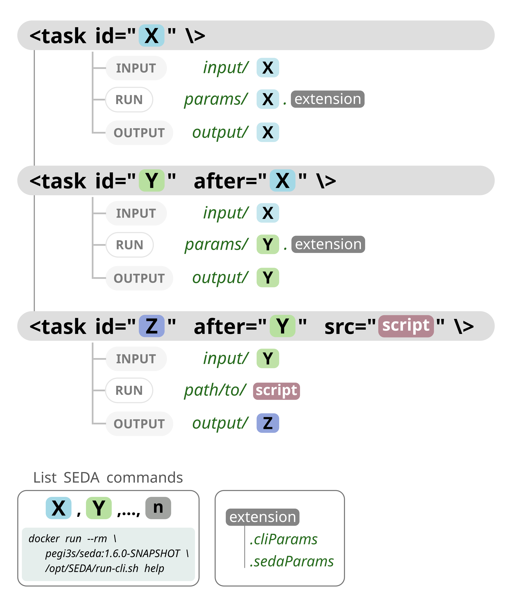

# SEDA pipelines with Compi

This project provides a framework for easily creating pipelines of [SEDA](https://www.sing-group.org/seda/) commands using [Compi](https://www.sing-group.org/compi/).

# Getting started

You can do two things with this project:
1. Understand how SEDA pipelines can be easily created with Compi and try the example pipeline (`pipeline.xml`).
2. Clone it and start creating your own SEDA pipeline.

## Testing the sample pipeline

To test the sample pipeline, simply:

1. Build the Docker image with `compi-dk build -drd -tv`. It will be named `test/seda-cli-pipeline`.
2. Run the pipeline with `run.sh /path/to/seda-compi-pipelines`.

If you are using Visual Studio Code, the `.vscode/tasks.json` defines tasks for doing this: *build* and *run-docker*.

## Creating your own SEDA pipeline

To create your own SEDA pipeline, clone the project and then:

1. Edit the `compi.project` file to set the name of your Docker image. Edit the `run.sh` file accordingly to use this Docker image.

2. Edit the `pipeline.xml` file to add one task for each SEDA command to be executed.

    2.1 Also edit the `pipeline-runner.xml` to specify the non-SEDA tasks if needed.

3. Build the image with `compi-dk build -drd -tv` (or run the *build* task within Visual Studio Code).

Note that the list of SEDA commands can be obtained with `docker run --rm pegi3s/seda:1.6.0-SNAPSHOT /opt/SEDA/run-cli.sh help` (or with the *show SEDA help* task).

# Understanding Compi-based SEDA pipelines

## Defining pipeline tasks: inputs and outputs




The minimal pipeline task looks like the following:

```
<task id="filtering"/>
```

Which means that the `filtering` command should be executed. As this task has not dependencies (i.e. previous tasks that must be executed before), its input files are taken from `input/filtering`. This means that all files in that directory will be processed by the command. The corresponding output files will be placed at `output/filtering` (as you should be expecting).

What if the same command must be executed more than once? In this case, each command must be suffixed with `_<number>`. 

Let's make our pipeline starts with two `filtering` commands:
```
<task id="filtering_1"/>
<task id="filtering_2"/>
```

In this case, the input files for the two initial pipeline tasks are taken from  `input/filtering_1` and  `input/filtering_2`. The corresponding output files will be created at `output/filtering_1` and `output/filtering_2` (again, no surprises here).

Lets add a task that comes after `filtering_1` and `filtering_2`. This task should run the `reformat` command, so it is as simple as:
```
<task id="reformat" after="filtering_1 filtering_2"/>
```

This tasks takes as input all files from the output files of its predecessor tasks, so it will process al files in `output/filtering_1` and `output/filtering_2` and create its output files in `output/reformat`.

To sum up what we have seen:

1. Task ids are just the name of the SEDA command to be executed. The list of SEDA commands can be obtained with `docker run --rm pegi3s/seda:1.6.0-SNAPSHOT /opt/SEDA/run-cli.sh help`.
2. If the same SEDA command is executed more than once, then tasks are disambiguated by adding the `<seda_command>_<number>` suffix.
3. Input files:
   1. For tasks without dependencies: all files in `input/<seda_command>`.
   2. For tasks with dependencies: all files in `output/<seda_command_after>` (where `<seda_command_after>` is the ID of the predecessor task, defined in the `after` propery).
4. Output files are created in `output/<seda_command>`.

These logic is handled by the `pipeline-runner.sh` script and all tasks are by default using this runner as specified in the `pipeline.xml`.

## SEDA command parameters

What about the parameters of the commands? For instance, the `filtering_1` task is being executed with `--minimum-sequence-length 7` and `filtering_2` with `--minimum-sequence-length 12`. The parameters of this tasks are defined in `params/filtering_1.cliParams` and `params/filtering_2.cliParams`.

The `pipeline-runner.sh` script looks for SEDA command parameter files in `params/<seda_command>`. These files should have one of these two extensions:

- `*.cliParams`: plain-text files containing only one line with the SEDA command CLI parameters (e.g. `--minimum-sequence-length 7`).
- `*.sedaParams`: JSON files containing command parameters. These files are generated by the GUI or CLI of SEDA.

For instance, the task `disambiguate` of the sample `pipeline.xml` takes its parameters from the file `disambiguate.sedaParams`.

## Running tasks for non-SEDA commands

If your pipeline needs to execute tasks for non-SEDA commands, you must:

1. Add the `src` property to the task definition to specify the path to the executable script. For instance, this is the case of the task `final-task` of the sample `pipeline.xml`:

```
<task id="final-task" after="reverse-complement" src="task-scripts/final-task.sh"></task>
```

2. Edit the `pipeline.xml` file to specify which tasks must be executed as shell scripts.

## Running commands in batches

Imagine that some tasks take as input a large amount of files (e.g. 10K) and you want to process them in smaller batches (e.g. 10K in 100 batches of 100 files), so that one SEDA command is executed for each batch of files. This way, you can control how many batches are executed in parallel and avoid memory exhaustion or other performance-related problems.

To specify the batch size for a specific task you should create a new `<param>` in the `pipeline.xml` file named `batchSize_<seda_command>`:
```
<param name="batchSize_filtering_2" shortName="bsf2" defaultValue="2"></param>
```

This way, the task `filtering_2` will be executed in batches of two files.

Note that if a task/command name contains the `-` character, it must be replaced with `_` when creating the `batchSize_<seda_command>` parameter (as it is the case for the task `reverse-complement` in the sample `pipeline.xml`):
```
<param name="batchSize_reverse_complement" shortName="bsrc" defaultValue="1"></param>
```
